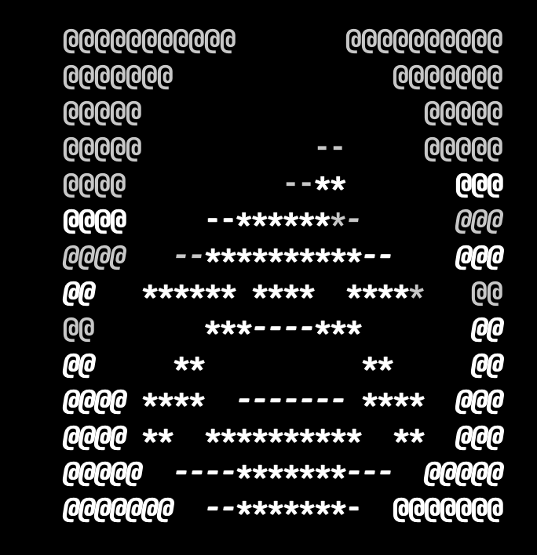

<div align="center">



# Pokemon Green Text RPG

**Claude Code Skill for Generation 1**

**[English](README.md)** | 한국어

</div>

1세대 포켓몬 그린 버전을 터미널에서 텍스트 RPG로 플레이하는 Claude Code 스킬입니다.

---

## 왜 이걸 만들었나요?

### 향수 (Nostalgia)

1996년, 게임보이 화면에서 처음 만났던 포켓몬. 그 시절의 설렘을 터미널에서 다시 느껴보고 싶었습니다.

### 실험 (Experiment)

이 프로젝트의 진짜 목적은 **"스킬을 통해 비결정론적인 LLM을 얼마나 결정론적으로 제어할 수 있는가?"**에 대한 실험입니다.

- LLM은 본질적으로 **비결정론적**입니다. 같은 입력에도 다른 출력.
- 하지만 충분한 데이터와 명확한 규칙을 제공한다면?
- **스킬(SKILL.md)이라는 제약 조건**을 통해 AI의 행동을 예측 가능하게 만들 수 있을까요?

Claude Code의 스킬 시스템을 통해 **"구조화된 데이터로 AI를 길들이기"**의 가능성을 탐구합니다.

---

## 데모

### 게임 시작 화면

```
╔══════════════════════════════════════════════════════════════════╗
║                                                                  ║
║                    POKEMON GREEN VERSION                         ║
║                                                                  ║
║    ░█▀█░█▀█░█░█░█▀▀░█▄█░█▀█░█▀█                                 ║
║    ░█▀▀░█░█░█▀▄░█▀▀░█░█░█░█░█░█                                 ║
║    ░▀░░░▀▀▀░▀░▀░▀▀▀░▀░▀░▀▀▀░▀░▀                                 ║
║                                                                  ║
║                    ♪ Opening BGM Playing...                      ║
║                                                                  ║
║              ┌─────────────────────────────────┐                 ║
║              │                                 │                 ║
║              │      [1] 새 게임                │                 ║
║              │      [2] 이어하기               │                 ║
║              │                                 │                 ║
║              └─────────────────────────────────┘                 ║
║                                                                  ║
╚══════════════════════════════════════════════════════════════════╝
```

### 오박사 인트로

```
╔══════════════════════════════════════════════════════════════════╗
║                                                                  ║
║               @@@@@@@@@          @@@@@@@@@                       ║
║               @@@@     **********  @@@@@@@                       ║
║               @@@@@  **   **     **  @@@@@                       ║
║               @@@@@    ***  *****    @@@@@                       ║
║               @@@@   **************    @@@                       ║
║               @@  *  **--*******-**  ** @@                       ║
║               @@  ******* ----  ******* @@                       ║
║               @@  *--**** ****  ***--** @@                       ║
║               @@   **  ***----***  **   @@                       ║
║                 ***  **          **  ***                         ║
║                 ***  ****       ***  ***                         ║
║               @@     **** ----  ***     @@                       ║
║               @@@@ ******       *****  @@@                       ║
║               @@@@@                  @@@@@                       ║
║               @@@@        @@@@         @@@                       ║
║                                                                  ║
║   ┌────────────────────────────────────────────────────────┐     ║
║   │                                                        │     ║
║   │  오박사:                                               │     ║
║   │  "안녕! 반갑구나!"                                     │     ║
║   │  "나는 오박사라고 한단다."                             │     ║
║   │  "사람들은 나를 포켓몬 박사라고 부르지."               │     ║
║   │                                                        │     ║
║   └────────────────────────────────────────────────────────┘     ║
║                                                                  ║
╚══════════════════════════════════════════════════════════════════╝
```

### 전투 화면


```
╔════════════════════════════════════════════════════════════════╗
║  야생 피카츄                                        Lv.5      ║
║  ▓▓▓▓▓▓▓▓▓▓░░░░  HP                                           ║
║                                                                ║
║                                          :.            :+=.   ║
║                                        .**.       . .-*#**#-  ║
║                                        -*:    =*+::-+#***+-   ║
║                                    .-*##%#+-:#%#+=+**+*+-     ║
║                                    =%%#########- .=***-.      ║
║                                   =%*#%#*+.:%%#*-   -*#=      ║
║                                   .=*#%%#*++*##%%*..+=:       ║
║                                   .:.:+#*%#+=#%##*+=-:        ║
║                                        :**==+*=+%%#=..        ║
║                                         :+*+++#%#%*:          ║
║                                             .++*%*.           ║
║                                                 :             ║
║                                                                ║
║       :  :                                                     ║
║       ++=*.                                                    ║
║    .-+-+--==..                                                 ║
║ .-+*+==+-=++=++:                                               ║
║ :++==+++++=-+=-=-:..==                                         ║
║ :+=-=+==++--=---:-+**#+                                        ║
║                                                                ║
║  이상해씨                                            Lv.5      ║
║  ▓▓▓▓▓▓▓▓▓▓▓▓▓░░  HP  22/22                                   ║
╠════════════════════════════════════════════════════════════════╣
║  야생 피카츄(이/가) 나타났다!                                  ║
╠════════════════════════════════════════════════════════════════╣
║     싸운다              가방                                   ║
║     포켓몬              도망                                   ║
╚════════════════════════════════════════════════════════════════╝
```

> 상대 포켓몬: 정면 전체 / 내 포켓몬: 뒷모습 (좌우반전, 상단만)

---

## 주요 기능

| 기능 | 설명 |
|------|------|
| 151마리 포켓몬 | 이상해씨부터 뮤까지 완전 수록 |
| 165개 기술 | 모든 1세대 기술 구현 |
| 1세대 버그 재현 | 에스퍼 vs 고스트 0배, 포커스 에너지 버그 등 |
| 관동 지방 | 태초마을 → 8개 체육관 → 사천왕 → 챔피언 |
| ASCII 아트 | 모든 포켓몬/NPC 스프라이트 |
| BGM 자동재생 | 45곡 오리지널 사운드트랙 |
| 울음소리 | 151마리 포켓몬 울음소리 |
| 기술 효과음 | 165개 기술별 효과음 |
| 세이브/로드 | 10개 슬롯 + 자동저장 |

---

## 시스템 요구사항

### 필수
- **Claude Code** (Anthropic CLI)
- macOS, Linux, 또는 Windows

### 오디오 (macOS 전용)

> **중요**: BGM, 효과음, 울음소리는 **macOS에서만** 재생됩니다.

이 스킬은 macOS의 `afplay` 명령어를 사용합니다. 다른 OS에서는:
- 게임 자체는 정상 작동
- 음악/효과음 재생만 불가

향후 Linux/Windows 지원을 위한 PR을 환영합니다!

---

## 설치 및 사용법

### 1. 저장소 클론

```bash
git clone https://github.com/your-username/pukiman.git
cd pukiman
```

### 2. Claude Code에서 실행

```bash
claude
```

### 3. 게임 시작

```
> 포켓몬
> 새 게임
```

또는

```
> 이어하기
```

### 언어 선택

- **한국어**: "포켓몬", "새 게임", "전투" 등
- **English**: "pokemon", "new game", "battle" 등

---

## 저작권 및 출처

이 프로젝트는 원작에 대한 **깊은 존경과 경의**를 담아 제작되었습니다.

### 원작 저작권자

**Pokemon은 Nintendo / Game Freak / Creatures Inc.의 등록 상표입니다.**

이 프로젝트는 팬메이드 비영리 프로젝트이며, 원작 저작권자의 권리를 존중합니다.

### 리소스 출처

#### ASCII 아트

| 리소스 | 출처 | 라이센스 |
|--------|------|----------|
| 포켓몬 전체 아트 | [MatheusFaria/pokedex_ascii.h](https://gist.github.com/MatheusFaria/4cbb8b6dbe33fd5605cf8b8f7130ba6d) | 공개 Gist |
| 원본 아티스트 | "mh" (fiikus.net, world-of-nintendo.com) | - |
| NPC 스프라이트 | [pret/pokered](https://github.com/pret/pokered) | 디컴파일 프로젝트 |

#### 오디오

| 리소스 | 출처 | 비고 |
|--------|------|------|
| BGM (45곡) | [Internet Archive - pkmn-rgby-soundtrack](https://archive.org/details/pkmn-rgby-soundtrack) | 공개 아카이브 |
| 울음소리 (151종) | [Pokemon Showdown](https://play.pokemonshowdown.com/) | 공개 리소스 |
| 기술 효과음 | [KHInsider](https://downloads.khinsider.com/game-soundtracks/album/pokemon-sfx-gen-1-attack-moves-rby) | 공개 사운드트랙 |
| 기술 효과음 (대체) | [The Sounds Resource](https://www.sounds-resource.com/game_boy_gbc/pokemonredblueyellow/) | 공개 리소스 |

#### 게임 데이터

| 데이터 | 출처 | 비고 |
|--------|------|------|
| 종족값/스탯 | Generation 1 공식 데이터 | 원작 기반 |
| 타입 상성표 | Generation 1 (버그 포함) | 1세대 고유 버그 재현 |
| 기술 데이터 | Generation 1 공식 데이터 | 165개 기술 |

---

## Disclaimer (면책 조항)

```
이 프로젝트는 순수하게 교육적, 실험적 목적으로 제작되었습니다.

- 비상업적 팬 프로젝트입니다
- 어떠한 수익도 창출하지 않습니다
- 원작 저작권자의 요청이 있을 경우 즉시 삭제됩니다
- 원작 구매를 권장합니다 (Nintendo eShop 등)

Pokemon 시리즈를 만들어주신
Nintendo, Game Freak, Creatures Inc.에
깊은 감사와 존경을 표합니다.
```

---

## 실험의 핵심 (Philosophy)

### "스킬로 AI를 제어할 수 있을까?"

LLM은 본질적으로 비결정론적입니다. 같은 프롬프트에도 매번 다른 답변을 내놓죠.

**하지만 충분히 구조화된 데이터와 명확한 규칙을 제공한다면?**

이 프로젝트는 그 질문에 대한 실험입니다:

- **151마리 포켓몬 데이터** → AI가 임의로 만들어내지 않고 정확한 스탯 사용
- **165개 기술 데이터** → 데미지 공식대로 정확히 계산
- **타입 상성표** → 2배, 0.5배, 0배를 규칙대로 적용
- **1세대 버그까지 명시** → "에스퍼 vs 고스트 = 0배"를 재현

스킬 문서에 **무엇을 어떻게 해야 하는지** 명확히 정의하면, 비결정론적인 LLM도 **결정론적인 게임 엔진처럼** 동작할 수 있습니다.

### 왜 포켓몬인가?

포켓몬 1세대는 이 실험에 완벽한 테스트베드입니다:

1. **명확한 규칙**: 데미지 공식, 포획률, 타입 상성 등 수치로 정의됨
2. **유한한 데이터**: 151마리, 165기술 - 완전히 열거 가능
3. **검증 가능**: 원작과 비교하여 정확도 측정 가능
4. **적절한 복잡도**: 단순하지만 다양한 상호작용 존재

### 발견한 것들

- **JSON 데이터**: AI가 일관되게 참조할 수 있는 진실의 원천(single source of truth)
- **명시적 규칙**: "이렇게 해라"가 아닌 "이 공식을 따라라"
- **예외 명시**: 버그조차 문서화하면 AI가 재현함
- **템플릿**: 출력 형식을 정의하면 일관된 UI 유지

### 앞으로의 가능성

이 실험이 성공한다면, 같은 방법론으로:

- **복잡한 보드게임**: 체스, 바둑, 카탄 등
- **시뮬레이션**: 정해진 규칙의 경제/생태계 모델
- **교육용 튜터**: 정확한 정답이 있는 학습 도우미
- **워크플로우 자동화**: 규칙 기반 업무 처리

**"AI는 제어할 수 없다"가 아니라, "어떻게 제어할 것인가"**의 문제입니다.

---

## 기여하기

이슈와 PR을 환영합니다!

- 버그 리포트
- 새로운 기능 제안
- Linux/Windows 오디오 지원
- 문서 개선

---

## 라이센스

- **프로젝트 코드**: MIT License
- **게임 리소스**: 각 출처의 라이센스를 따릅니다
- **Pokemon 관련 자산**: Nintendo/Game Freak/Creatures Inc. 소유

---

<div align="center">

**Made with love and nostalgia**

*1996년의 그 설렘을 기억하며*

</div>
